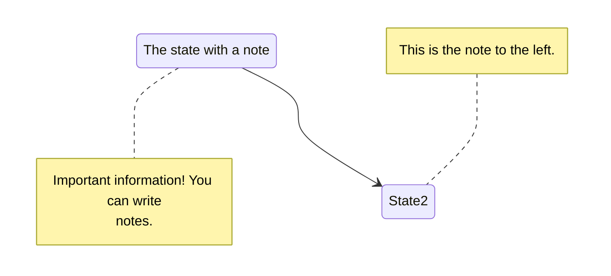

# Mermaid Chart

[MermaidJS](https://mermaid-js.github.io/) is library for generating svg charts and diagrams from text.

Diagrams are authored as fenced ` ```mermaid ` code blocks — the theme ships a
render hook that turns every fence into a chart on the rendered page. No
shortcode is needed (the old `` shortcode form was removed
from this theme; fenced blocks are the only supported syntax).

## Example


